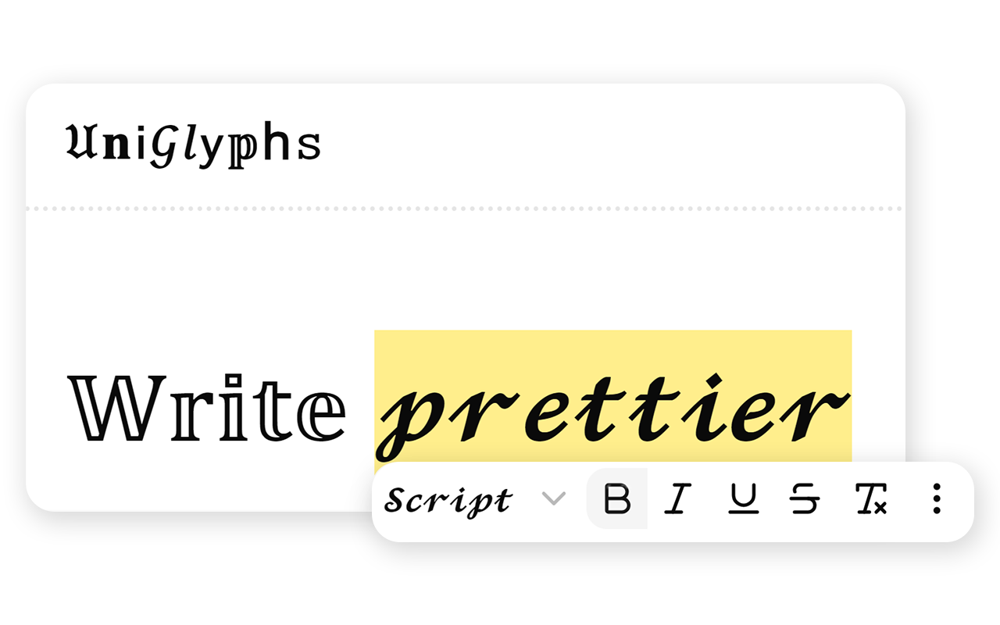
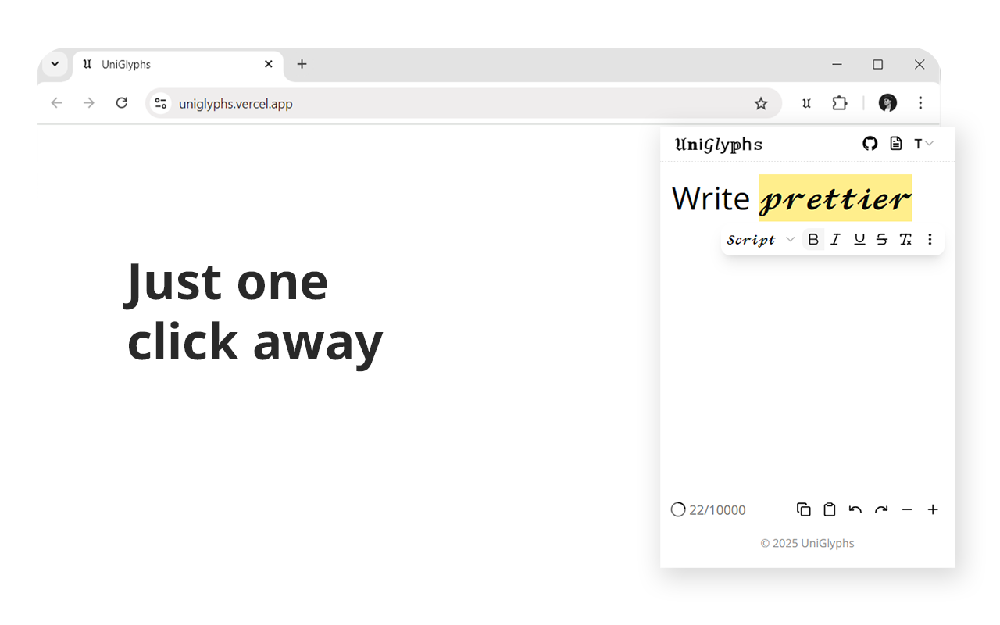

<div align="center">
  <h1>𝔘𝐧𝗂𝒢𝑙𝗒𝕡h𝚜</h1>
</div>

<div align="center">
   <strong>A browser extension that lets you 𝓼𝓽𝔂𝓵𝓮 text on any website using a dynamic toolbar</strong>
</div>

###

<div align="center">
  <a href="https://youtu.be/p0QjqGF4K7A" target="_blank">
    
  </a>
  <p><em>Tap the preview to view the full video</em></p>
</div>

###

## About

**UniGlyphs** is a browser extension that lets users style text using Unicode. It provides a floating toolbar for styling text that works on websites like Facebook, along with a full-page editor and popup editor in the browser. It gives users an expressive way to write posts, comments, and more, even on platforms that don’t allow custom fonts. Styled text is generated using Unicode characters that resemble different font styles, such as 𝐛𝐨𝐥𝐝, 𝑖𝑡𝑎𝑙𝑖𝑐, and 𝔤𝔬𝔱𝔥𝔦𝔠, which persists their look anywhere.

<div align="center" style="display: flex; justify-content: space-between;">
  
  
</div>

## Features

- **Floating Toolbar**: for formatting their texts in any textbox. It appears when a supported text field is clicked and follows the caret as it moves.
- **Popup Editor**: for times when the floating toolbar is not available.
- **Web-Based Editor**: for more extensive editing and documentation.
- **Style Variety**: diverse selection of Unicode sets that mimic font styles, such as bold serif (𝐀), italic sans (𝘈), double-struck (𝔸).
- **Font Select**: users can select a font (an actual font) from a dropdown menu to change the font of the whole website to test Unicode support.
- **Keyboard Shortcuts**: quickly toggle styles using key combinations. (e.g., `Ctrl+B` for bold, `Ctrl+I` for italic, etc.) for a more efficient workflow.
- **Persistent State**: saves essential data like the text and selected settings to continue editing even after leaving the page or closing the popup.


## Usage

1. Install from the [Chrome Web Store](https://chromewebstore.google.com/detail/) (Not yet available, see how to clone in [development](#development)). Once installed, the toolbar activates on supported text inputs.
2. Visit a supported site with a text box (e.g., Facebook).
3. Click into any text input field (like when posting) to show the toolbar following the caret.
4. Or open the extension popup to use the editor and then copy the text.
5. You can also visit the [homepage](https://uniglyphs.vercel.app/) to use the web-based editor and copy the text there. While you're there, you can also read the documentation and FAQs.


## Development

### Tech Stack

- **Web**: React, Next.js
- **Extension**: WXT (Web eXtension Toolkit)
- **Styling**: Tailwind CSS, shadcn/ui
- **Monorepo**: Turborepo
- **Package manager**: pnpm

### Setup

1. Clone the repository:

   ```bash
   git clone https://github.com/andrianllmm/uniglyphs.git
   cd uniglyphs
   ```

2. Install pnpm:

   ```bash
   npm install -g pnpm
   ```

2. Install dependencies:

   ```bash
   pnpm install
   ```

3. Start the development server:

   ```bash
   pnpm dev
   ```

4. Load the extension in Chrome via `chrome://extensions`. Turn on developer mode in the extension settings. Load the unpacked extension from the `apps/web-extension/.output` directory.
