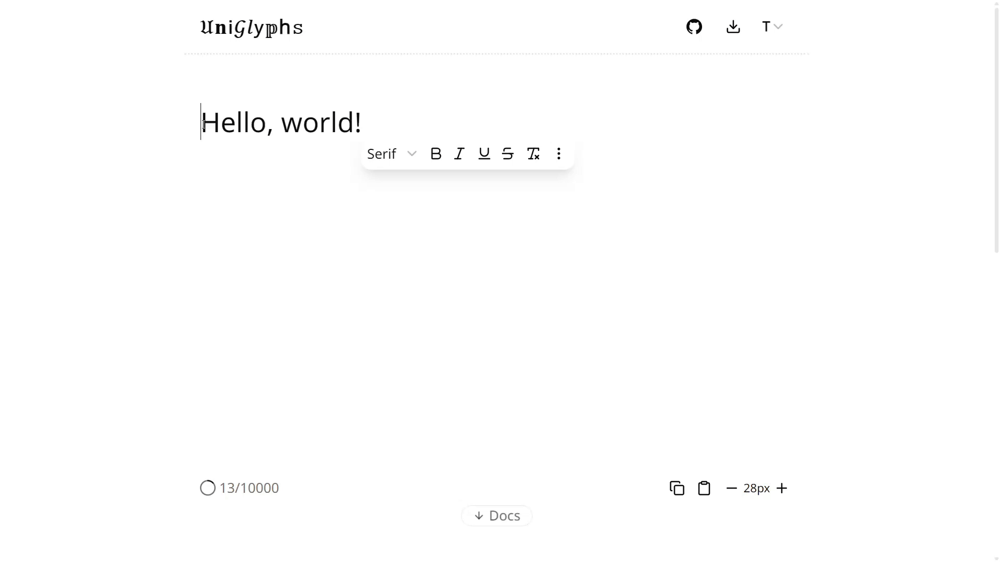
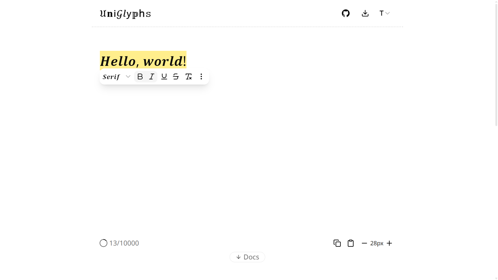
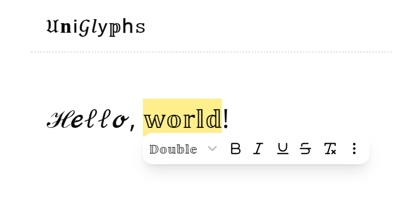
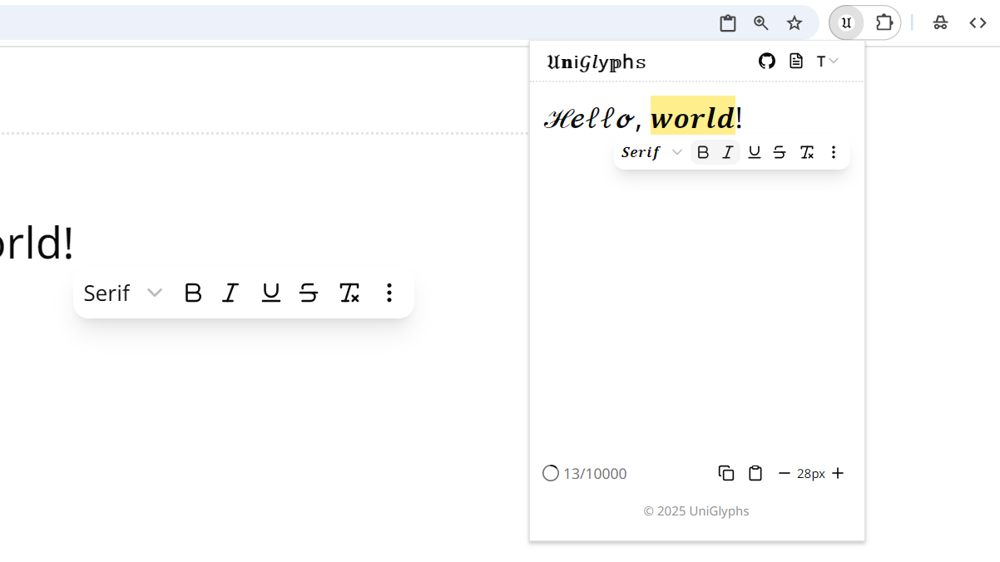
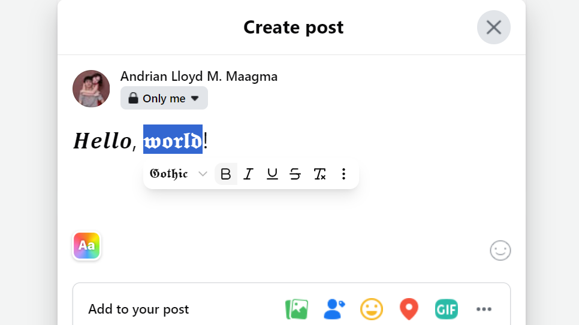

# 𝔘𝐧𝗂𝒢𝑙𝗒𝕡h𝚜
#### Video Demo: https://youtu.be/J3T_diS7Ot4?si=N3lcjpxVoEf8q4re
#### Description: A browser extension to 𝒔𝒕𝒚𝒍𝒆 Unicode text anywhere using a floating toolbar.

<div align="center">
  
</div>

## About

**UniGlyphs** is a browser extension that lets users style text using Unicode characters. It provides a floating toolbar for styling text that works on websites like Facebook, along with a full-page editor and popup editor in the browser. The goal is to give users an expressive way to write posts, comments, and more, even on platforms that don’t allow custom fonts. This being an extension makes it more easy for users to use, since they don't have to switch tabs and copy-paste from a different website, which mosts alternatives offer. Styled text is generated using Unicode characters that resemble different font styles, such as 𝐛𝐨𝐥𝐝, 𝑖𝑡𝑎𝑙𝑖𝑐, and 𝔤𝔬𝔱𝔥𝔦𝔠, which persists their look anywhere.

This project was built as a final requirement for [CS50x](https://cs50.harvard.edu/x/). It demonstrates concepts learned from the course such as character encoding (Unicode), and web development using HTML, CSS, and JavaScript.


## Features

- **Floating Toolbar**: users can use a toolbar for formatting their texts in any textbox. It appears automatically on websites when users click into a supported text field and follows the caret as it moves. This enables users to quickly format their text without having to leave the textbox.
- **Popup Editor**: users can also access a popup version of an editor (with the floating toolbar) by clicking the extension icon in their browsers. This lets users type, style, and copy Unicode-styled text directly if ever the floating toolbar is not available.
- **Web-Based Editor**: users can also visit the homepage for the same editor for more extensive editing and formatting and documentation for reference and frequently asked questions (FAQs). It also serves as the landing page to engage more users.
- **Style Variety**: the toolbar includes a diverse selection of Unicode sets that mimic font styles, such as bold serif (𝐀), italic sans (𝘈), double-struck (𝔸), and more that is in need when users are writing on platforms that don’t allow such custom text styling.
- **Font Select**: users can select a font (an actual font) from a dropdown menu to change the font of the whole website to test Unicode support for styled text.
- **Keyboard Shortcuts**: users can quickly toggle styles using key combinations. (e.g., `Ctrl+B` for bold, `Ctrl+I` for italic, etc.) for a more efficient workflow. These shortcuts are intuitive and easy to remember since they are based on conventional keyboard shortcuts for text formatting. They can be discovered via tooltips in the toolbar or by reading the documentation.
- **Persistent State**: the editor also saves essential data such as the last entered text and selected style settings using `localStorage`. This ensures that users can continue to use the editor even after closing the browser or refreshing the page.


## Design Choices

- **WXT vs WebExtension APIs**: chose WXT instead of just the classic WebExtension APIs for its improved developer experience, faster build setup, and built-in support for modern tooling like automatic reloading, while still outputting standard WebExtension-compatible code that can be used in any browser.
- **Next.js vs React**: chose Next.js instead of just React for its built-in routing and server-side rendering, enabling faster development and better performance out of the box.
- **Use of Unicode for styling**: chose Unicode styling to maintain consistent text appearance across platforms that restrict CSS or font customization. Unicode characters are standardized and widely supported across platforms. They offer a lot of characters that mimic font styles.
- **Use of Monorepo (Turborepo)**: chose a monorepo to streamline development by enabling shared code, components, and configurations across both web and extension targets. Since i have two apps (web and extension), it is easier to manage shared logic, components, and configurations across both.
- **Client-side vs server-side persistence**: chose `localStorage` for simple, backend-free data persistence, reducing infrastructure needs and complexity. It only saves the last entered text and selected style settings which are not sensitive data.
- **TypeScript vs JavaScript**: chose TypeScript instead of just plain JavaScript since it offers improved type safety and better developer experience as it catches common errors at compile time.
- **Tailwind vs Plain CSS**: chose Tailwind instead of plain CSS for its inline styling and utility-first approach, while still allowing for customization and flexibility.
- **npm vs pnpm**: chose pnpm for its faster installation and dependency management, recommended for a monorepo like this one.


## Usage

1. Install from the [Chrome Web Store](https://chrome.google.com/webstore) (Not yet available, see how to clone in [development](#development)). Once installed, the toolbar activates on supported text inputs.
2. Visit a supported site with a text box (e.g., Facebook).
3. Click into any text input field (like when posting) to show the toolbar following the caret.
4. Or open the extension popup to use the editor and then copy the text.
5. Similarly, you can also visit the [homepage](#) to use the web-based editor and copy the text there. While you're there, you can also read the documentation and FAQs.


## Examples







## File Structure

- `apps/web/` – Main web app
   - `pages/` – Pages representing each route
   - `components/` – Reusable UI components used across pages
      - `docs/` – Components for displaying documentation content
- `apps/extension/` – Browser extension
   - `entrypoints/` – Main entry points for different extension contexts.
      - `content/` – Content scripts injected into web pages (e.g., toolbar)
      - `popup/` – Scripts and components for the extension popup UI
    - `components/` – Reusable UI components for the extension
- `packages/ui/` – Shared package for reusable UI logic and styling across both targets
   - `src/components/` – Common UI elements (e.g., buttons, inputs)
   - `src/components/editor/` – Specialized components for the text editor (e.g., textbox, toolbar)
   - `src/lib/textTools/` – Utility functions for handling Unicode text formatting
   - `src/lib/caretPosition/` – Functions to track and manage the caret position for the floating toolbar
   - `src/styles/` – Shared Tailwind CSS configuration and global styles


## Development

### Tech Stack

- **Web**: React, Next.js
- **Extension**: WXT (Web eXtension Toolkit)
- **Styling**: Tailwind CSS, shadcn/ui
- **Monorepo**: Turborepo
- **Package manager**: pnpm

### Setup

1. Clone the repository:

   ```bash
   git clone https://github.com/andrianllmm/uniglyphs.git
   cd uniglyphs
   ```

2. Install pnpm:

   ```bash
   npm install -g pnpm
   ```

2. Install dependencies:

   ```bash
   pnpm install
   ```

3. Start the development server:

   ```bash
   pnpm dev
   ```

4. Load the extension in Chrome via `chrome://extensions`. Turn on developer mode in the extension settings. Load the unpacked extension from the `apps/web-extension/.output` directory.

### Testing

No testing yet.