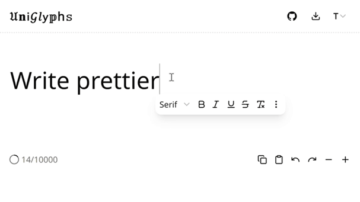
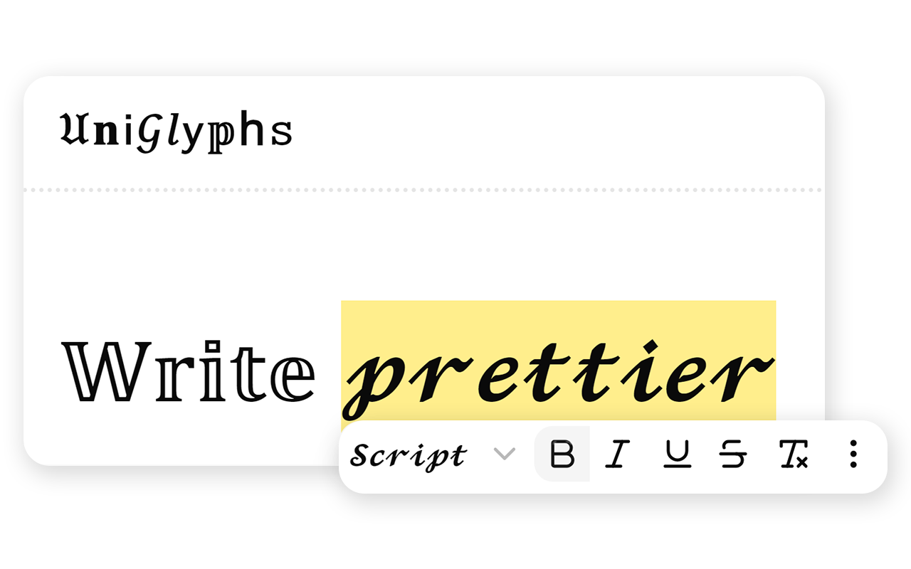
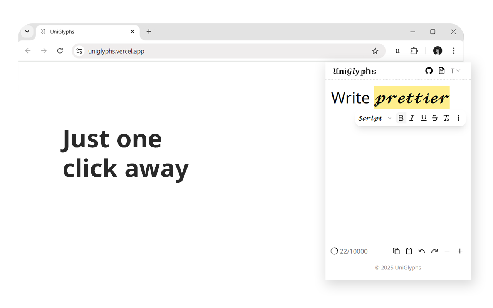

<div align="center">

[![Chrome Web Store][chrome-badge]][chrome-url]
[![Vercel][vercel-badge]][vercel-url] [![License][license-badge]](LICENSE)
[![GitHub stars][stargazers-badge]](https://github.com/andrianllmm/uniglyphs/stargazers)

# 𝔘𝐧𝗂𝒢𝑙𝗒𝕡h𝚜

<!-- UniGlyphs -->

**A browser extension that lets you format text on any website using an inline
toolbar**



[![Watch Demo][youtube-badge]][youtube-url]

</div>

<!-- TABLE OF CONTENTS -->
<details>
  <summary>Table of Contents</summary>
  <ol>
    <li>
      <a href="#about">About</a>
      <ul>
        <li><a href="#features">Features</a></li>
         <li><a href="#technologies">Technologies</a></li>
      </ul>
    </li>
    <li><a href="#installation">Installation</a></li>
    <li><a href="#usage">Usage</a></li>
    <li>
      <a href="#dev-setup">Dev Setup</a>
      <ul>
        <li><a href="#configuration">Configuration</a></li>
      </ul>
    </li>
    <li><a href="#contributing">Contributing</a></li>
    <li><a href="#issues">Issues</a></li>
  </ol>
</details>

## About

UniGlyphs is a browser extension that lets you format text directly on sites
like Facebook, X (formerly Twitter), LinkedIn, and many more. Just highlight
some text, and an inline toolbar pops up, so you can format it on the spot.
There's also a full-page editor and a popup version if you want more space to
work.

With UniGlyphs, you can make your posts and comments stand out—even on platforms
that don’t normally allow it. Behind the scenes, it uses
<a href="https://en.wikipedia.org/wiki/Unicode" target="_blank">Unicode</a>
characters that mimic different "fonts", like 𝐛𝐨𝐥𝐝, 𝑖𝑡𝑎𝑙𝑖𝑐, and 𝔤𝔬𝔱𝔥𝔦𝔠, so the
styling sticks no matter where you paste it.

<div align="center" style="display: flex; justify-content: center;">
  
  
</div>

### Features

- **Inline/floating Toolbar**: pops up when you click on a text box and stays
  near your cursor while you type.
- **Popup Editor**: opens in a small window for editing when the inline toolbar
  isn't available.
- **Full-page Editor**: a web-based editor for longer posts, drafts, or when you
  want more space.
- **Style Variety**: choose from a variety of styles that look like different
  fonts, such as bold serif (𝐀), italic sans (𝘈), double-struck (𝔸).
- **Font Select**: change the actual font of a website to see how well it
  supports different Unicode characters.
- **Keyboard Shortcuts**: use familiar keys like <kbd>Ctrl</kbd>+<kbd>B</kbd>
  for bold or <kbd>Ctrl</kbd>+<kbd>I</kbd> for italic to format text faster.
- **Persistent State**: keeps your text and settings, so you can pick up where
  you left off—even if you close the tab.

### Technologies

- **Web**: [Next.js](https://nextjs.org), [React](https://reactjs.org),
  [Vercel](https://vercel.com)
- **Extension**: [WXT](https://wxt.dev)
- **Styling**: [Tailwind CSS](https://tailwindcss.com),
  [shadcn/ui](https://ui.shadcn.com)
- **Monorepo**: [Turborepo](https://turborepo.org)

## Installation

| Browser                  | Status    | Install from                   |
| ------------------------ | --------- | ------------------------------ |
| ![Chrome][chrome-logo]   | Available | [Chrome Web Store][chrome-url] |
| ![Firefox][firefox-logo] | Planned   | [Firefox Add-ons][firefox-url] |

## Usage

1. Visit a supported site (e.g., Facebook) (see
   [supported sites](/apps/web-extension/utils/matches.ts)).
2. Click any text box (like when posting) to show the toolbar following the
   caret.
   > ⚠️ If the toolbar behaves strangely, the site may be using input components
   > that aren’t fully supported. Use the popup instead.
3. Open the extension popup to use the editor and then copy the text.
4. You can also visit the [homepage](https://uniglyphs.vercel.app/) to use the
   full-page editor and copy the text there. While you're there, you can also
   read the documentation and FAQs.

## Dev Setup

1. Clone the repo
   ```sh
   git clone https://github.com/andrianllmm/uniglyphs.git
   cd uniglyphs
   ```
2. Install [pnpm](https://pnpm.io/)
   ```sh
   npm install -g pnpm
   ```
3. Install the dependencies
   ```sh
   pnpm install
   ```
4. Run the development server
   ```sh
   pnpm dev
   ```
5. Load the extension in Chrome via `chrome://extensions`. Turn on developer
   mode in the extension settings. Load the unpacked extension from the
   `apps/web-extension/.output` directory (this is generated after running
   `pnpm dev`).

### Configuration

Create a `apps/web/.env` and `apps/web-extension/.env` file and configure the
variables based on the `.env.example` files.

## Contributing

Contributions are welcome! To get started:

1. Fork the project
2. Create your feature branch (`git checkout -b feature/AmazingFeature`)
3. Commit your changes (`git commit -m 'Add some AmazingFeature'`)
4. Push to the branch (`git push origin feature/AmazingFeature`)
5. Open a pull request

## Issues

Found a bug or issue? Report it on the
[issues page](https://github.com/andrianllmm/uniglyphs/issues).

<!-- URLs -->

[chrome-url]:
  https://chromewebstore.google.com/detail/hcnbmicjiggmklnmkpljeomkmagigkbc
[firefox-url]: https://addons.mozilla.org/en-US/firefox/extensions
[vercel-url]: https://uniglyphs.vercel.app
[youtube-url]: https://youtu.be/p0QjqGF4K7A

<!-- Badges -->

[chrome-logo]:
  https://img.shields.io/badge/-Chrome-4285F4?logo=googlechrome&logoColor=white&style=for-the-badge
[firefox-logo]:
  https://img.shields.io/badge/-Firefox-FF7139?logo=firefox&logoColor=white&style=for-the-badge
[chrome-badge]:
  https://img.shields.io/badge/-Chrome%20Web%20Store-blue?logo=google-chrome&logoColor=white&style=flat
[vercel-badge]: https://vercelbadge.vercel.app/api/andrianllmm/uniglyphs
[license-badge]:
  https://img.shields.io/github/license/andrianllmm/uniglyphs?style=flat
[stargazers-badge]:
  https://img.shields.io/github/stars/andrianllmm/uniglyphs?style=flat&logo=github
[youtube-badge]:
  https://img.shields.io/badge/Watch%20Demo-red?style=flat&logo=youtube&logoColor=white
